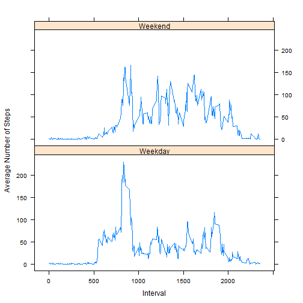

Peer Assessment 1: Reproducible Research 
========================================================
Loading and processing the data
=================


```r
data <- read.csv("activity.csv", header = T, sep = ",")
```

Convert date to date class


```r
data$Date <- as.Date(data$date, "%Y-%m-%d")
```

Convert interval to a factor


```r
data$interval <- as.factor(data$interval)
```


Extract levels of 5-min intervals

```r
lev <- levels(data$interval)
```

Average total number of steps taken per day

```r
library(plyr)
totalSteps <- tapply(data$steps, data$date, sum, na.rm = T)
avgSteps <- tapply(data$steps, data$date, mean, na.rm = T)
summary(totalSteps)
```

```
##    Min. 1st Qu.  Median    Mean 3rd Qu.    Max. 
##       0    6780   10400    9350   12800   21200
```

```r
summary(avgSteps)
```

```
##    Min. 1st Qu.  Median    Mean 3rd Qu.    Max.    NA's 
##    0.14   30.70   37.40   37.40   46.20   73.60       8
```

```r
hist(totalSteps, breaks = 10, col = "green", main = "Total Number of steps each day", 
    xlab = "Average Steps per day")
```

 

daily Average  activity pattern

```r
Steps = tapply(data$steps, data$interval, mean, na.rm = T)
```


```r
df <- data.frame(Steps, as.numeric(lev))
```

draw a ggplot

```r
library(ggplot2)
g <- ggplot(df, aes(as.numeric(lev), Steps))
g + geom_line(colour = "green") + ggtitle("Time Series Plot of the 5-minute Interval\n and the Average Number of Steps,\n Taken across all Days") + 
    ylab("Average Number of Steps")
```

 

Imputing missing values
======================

```r

missing <- is.na(data)
(n.missing <- sum(missing))
```

```
## [1] 2304
```

```r

library(mice)
```

```
## Loading required package: Rcpp
## mice 2.21 2014-02-05
```

```r
library(Amelia)
```

```
## Loading required package: foreign
## Loading required package: RcppArmadillo
## ## 
## ## Amelia II: Multiple Imputation
## ## (Version 1.7.2, built: 2013-04-03)
## ## Copyright (C) 2005-2014 James Honaker, Gary King and Matthew Blackwell
## ## Refer to http://gking.harvard.edu/amelia/ for more information
## ##
```

```r
set.seed(144)
imputedData <- complete(mice(data))
```

```
## 
##  iter imp variable
##   1   1  steps
##   1   2  steps
##   1   3  steps
##   1   4  steps
##   1   5  steps
##   2   1  steps
##   2   2  steps
##   2   3  steps
##   2   4  steps
##   2   5  steps
##   3   1  steps
##   3   2  steps
##   3   3  steps
##   3   4  steps
##   3   5  steps
##   4   1  steps
##   4   2  steps
##   4   3  steps
##   4   4  steps
##   4   5  steps
##   5   1  steps
##   5   2  steps
##   5   3  steps
##   5   4  steps
##   5   5  steps
```

```r

a.out <- amelia(data, cs = "date", m = 1)
```

```
## Amelia Error Code:  37 
##  The following variable(s) are 'factors': 
## interval
## You may have wanted to set this as a ID variable to remove it
## from the imputation model or as an ordinal or nominal
## variable to be imputed.  Please set it as either and
## try again.
```

```r
# Data frame after imputing
a <- a.out$imputations$imp1
totStepsImp <- tapply(a$steps, a$date, sum)
```

```
## Error: first argument must be a vector
```

```r


# Impute by replacing NA by the mean of steps
data$steps[is.na(data$steps)] <- tapply(data$steps, data$interval, mean, na.rm = TRUE)
# Number of total steps each day
totStepsImp <- tapply(data$steps, data$date, sum)

# Summary statistics before and after imputing
summary(totalSteps)
```

```
##    Min. 1st Qu.  Median    Mean 3rd Qu.    Max. 
##       0    6780   10400    9350   12800   21200
```

```r
print(totalSteps)
```

```
## 2012-10-01 2012-10-02 2012-10-03 2012-10-04 2012-10-05 2012-10-06 
##          0        126      11352      12116      13294      15420 
## 2012-10-07 2012-10-08 2012-10-09 2012-10-10 2012-10-11 2012-10-12 
##      11015          0      12811       9900      10304      17382 
## 2012-10-13 2012-10-14 2012-10-15 2012-10-16 2012-10-17 2012-10-18 
##      12426      15098      10139      15084      13452      10056 
## 2012-10-19 2012-10-20 2012-10-21 2012-10-22 2012-10-23 2012-10-24 
##      11829      10395       8821      13460       8918       8355 
## 2012-10-25 2012-10-26 2012-10-27 2012-10-28 2012-10-29 2012-10-30 
##       2492       6778      10119      11458       5018       9819 
## 2012-10-31 2012-11-01 2012-11-02 2012-11-03 2012-11-04 2012-11-05 
##      15414          0      10600      10571          0      10439 
## 2012-11-06 2012-11-07 2012-11-08 2012-11-09 2012-11-10 2012-11-11 
##       8334      12883       3219          0          0      12608 
## 2012-11-12 2012-11-13 2012-11-14 2012-11-15 2012-11-16 2012-11-17 
##      10765       7336          0         41       5441      14339 
## 2012-11-18 2012-11-19 2012-11-20 2012-11-21 2012-11-22 2012-11-23 
##      15110       8841       4472      12787      20427      21194 
## 2012-11-24 2012-11-25 2012-11-26 2012-11-27 2012-11-28 2012-11-29 
##      14478      11834      11162      13646      10183       7047 
## 2012-11-30 
##          0
```

```r
summary(totStepsImp)
```

```
##    Min. 1st Qu.  Median    Mean 3rd Qu.    Max. 
##      41    9820   10800   10800   12800   21200
```

```r
print(totStepsImp)
```

```
## 2012-10-01 2012-10-02 2012-10-03 2012-10-04 2012-10-05 2012-10-06 
##      10766        126      11352      12116      13294      15420 
## 2012-10-07 2012-10-08 2012-10-09 2012-10-10 2012-10-11 2012-10-12 
##      11015      10766      12811       9900      10304      17382 
## 2012-10-13 2012-10-14 2012-10-15 2012-10-16 2012-10-17 2012-10-18 
##      12426      15098      10139      15084      13452      10056 
## 2012-10-19 2012-10-20 2012-10-21 2012-10-22 2012-10-23 2012-10-24 
##      11829      10395       8821      13460       8918       8355 
## 2012-10-25 2012-10-26 2012-10-27 2012-10-28 2012-10-29 2012-10-30 
##       2492       6778      10119      11458       5018       9819 
## 2012-10-31 2012-11-01 2012-11-02 2012-11-03 2012-11-04 2012-11-05 
##      15414      10766      10600      10571      10766      10439 
## 2012-11-06 2012-11-07 2012-11-08 2012-11-09 2012-11-10 2012-11-11 
##       8334      12883       3219      10766      10766      12608 
## 2012-11-12 2012-11-13 2012-11-14 2012-11-15 2012-11-16 2012-11-17 
##      10765       7336      10766         41       5441      14339 
## 2012-11-18 2012-11-19 2012-11-20 2012-11-21 2012-11-22 2012-11-23 
##      15110       8841       4472      12787      20427      21194 
## 2012-11-24 2012-11-25 2012-11-26 2012-11-27 2012-11-28 2012-11-29 
##      14478      11834      11162      13646      10183       7047 
## 2012-11-30 
##      10766
```


Impute by replacing NA by the mean of steps

```r
totstepint <- tapply(data$steps, data$interval, mean, na.rm = TRUE)
print(totstepint)
```

```
##         0         5        10        15        20        25        30 
##   1.71698   0.33962   0.13208   0.15094   0.07547   2.09434   0.52830 
##        35        40        45        50        55       100       105 
##   0.86792   0.00000   1.47170   0.30189   0.13208   0.32075   0.67925 
##       110       115       120       125       130       135       140 
##   0.15094   0.33962   0.00000   1.11321   1.83019   0.16981   0.16981 
##       145       150       155       200       205       210       215 
##   0.37736   0.26415   0.00000   0.00000   0.00000   1.13208   0.00000 
##       220       225       230       235       240       245       250 
##   0.00000   0.13208   0.00000   0.22642   0.00000   0.00000   1.54717 
##       255       300       305       310       315       320       325 
##   0.94340   0.00000   0.00000   0.00000   0.00000   0.20755   0.62264 
##       330       335       340       345       350       355       400 
##   1.62264   0.58491   0.49057   0.07547   0.00000   0.00000   1.18868 
##       405       410       415       420       425       430       435 
##   0.94340   2.56604   0.00000   0.33962   0.35849   4.11321   0.66038 
##       440       445       450       455       500       505       510 
##   3.49057   0.83019   3.11321   1.11321   0.00000   1.56604   3.00000 
##       515       520       525       530       535       540       545 
##   2.24528   3.32075   2.96226   2.09434   6.05660  16.01887  18.33962 
##       550       555       600       605       610       615       620 
##  39.45283  44.49057  31.49057  49.26415  53.77358  63.45283  49.96226 
##       625       630       635       640       645       650       655 
##  47.07547  52.15094  39.33962  44.01887  44.16981  37.35849  49.03774 
##       700       705       710       715       720       725       730 
##  43.81132  44.37736  50.50943  54.50943  49.92453  50.98113  55.67925 
##       735       740       745       750       755       800       805 
##  44.32075  52.26415  69.54717  57.84906  56.15094  73.37736  68.20755 
##       810       815       820       825       830       835       840 
## 129.43396 157.52830 171.15094 155.39623 177.30189 206.16981 195.92453 
##       845       850       855       900       905       910       915 
## 179.56604 183.39623 167.01887 143.45283 124.03774 109.11321 108.11321 
##       920       925       930       935       940       945       950 
## 103.71698  95.96226  66.20755  45.22642  24.79245  38.75472  34.98113 
##       955      1000      1005      1010      1015      1020      1025 
##  21.05660  40.56604  26.98113  42.41509  52.66038  38.92453  50.79245 
##      1030      1035      1040      1045      1050      1055      1100 
##  44.28302  37.41509  34.69811  28.33962  25.09434  31.94340  31.35849 
##      1105      1110      1115      1120      1125      1130      1135 
##  29.67925  21.32075  25.54717  28.37736  26.47170  33.43396  49.98113 
##      1140      1145      1150      1155      1200      1205      1210 
##  42.03774  44.60377  46.03774  59.18868  63.86792  87.69811  94.84906 
##      1215      1220      1225      1230      1235      1240      1245 
##  92.77358  63.39623  50.16981  54.47170  32.41509  26.52830  37.73585 
##      1250      1255      1300      1305      1310      1315      1320 
##  45.05660  67.28302  42.33962  39.88679  43.26415  40.98113  46.24528 
##      1325      1330      1335      1340      1345      1350      1355 
##  56.43396  42.75472  25.13208  39.96226  53.54717  47.32075  60.81132 
##      1400      1405      1410      1415      1420      1425      1430 
##  55.75472  51.96226  43.58491  48.69811  35.47170  37.54717  41.84906 
##      1435      1440      1445      1450      1455      1500      1505 
##  27.50943  17.11321  26.07547  43.62264  43.77358  30.01887  36.07547 
##      1510      1515      1520      1525      1530      1535      1540 
##  35.49057  38.84906  45.96226  47.75472  48.13208  65.32075  82.90566 
##      1545      1550      1555      1600      1605      1610      1615 
##  98.66038 102.11321  83.96226  62.13208  64.13208  74.54717  63.16981 
##      1620      1625      1630      1635      1640      1645      1650 
##  56.90566  59.77358  43.86792  38.56604  44.66038  45.45283  46.20755 
##      1655      1700      1705      1710      1715      1720      1725 
##  43.67925  46.62264  56.30189  50.71698  61.22642  72.71698  78.94340 
##      1730      1735      1740      1745      1750      1755      1800 
##  68.94340  59.66038  75.09434  56.50943  34.77358  37.45283  40.67925 
##      1805      1810      1815      1820      1825      1830      1835 
##  58.01887  74.69811  85.32075  59.26415  67.77358  77.69811  74.24528 
##      1840      1845      1850      1855      1900      1905      1910 
##  85.33962  99.45283  86.58491  85.60377  84.86792  77.83019  58.03774 
##      1915      1920      1925      1930      1935      1940      1945 
##  53.35849  36.32075  20.71698  27.39623  40.01887  30.20755  25.54717 
##      1950      1955      2000      2005      2010      2015      2020 
##  45.66038  33.52830  19.62264  19.01887  19.33962  33.33962  26.81132 
##      2025      2030      2035      2040      2045      2050      2055 
##  21.16981  27.30189  21.33962  19.54717  21.32075  32.30189  20.15094 
##      2100      2105      2110      2115      2120      2125      2130 
##  15.94340  17.22642  23.45283  19.24528  12.45283   8.01887  14.66038 
##      2135      2140      2145      2150      2155      2200      2205 
##  16.30189   8.67925   7.79245   8.13208   2.62264   1.45283   3.67925 
##      2210      2215      2220      2225      2230      2235      2240 
##   4.81132   8.50943   7.07547   8.69811   9.75472   2.20755   0.32075 
##      2245      2250      2255      2300      2305      2310      2315 
##   0.11321   1.60377   4.60377   3.30189   2.84906   0.00000   0.83019 
##      2320      2325      2330      2335      2340      2345      2350 
##   0.96226   1.58491   2.60377   4.69811   3.30189   0.64151   0.22642 
##      2355 
##   1.07547
```

 
 cbind(mean(summary$Steps), mean(summary$Steps))
 
 [1,] 10836 10766
 
 plot the 2 graphs for part one and part 2 histogram
 

```r
par(mfcol = c(1, 2))
hist(totstepint, col = "red", xlab = "Average Total Number of Steps after Imputing", 
    main = "", breaks = 10)
title("Total Number of steps\n each day After Imputing")
hist(totalSteps, breaks = 10, col = "green", main = "part 1- Total Number of steps each day before imputing", 
    xlab = "Average Steps per day")
```

 


from the data it is clear that missing values have an effect on the total steps. their is a reduction in steps towards the last days


Are there differences in activity patterns between weekdays and weekends?
=========================================================================


```r
data$Days <- weekdays(as.Date(as.character(data$date)))
d <- data$Days == "Saturday" | data$Days == "Sunday"
```

Call Saturday and Sunday Weekend

```r
data$Days[d] = "Weekend"
```

Call weekdays (Monday through Friday) Weekdays

```r
data$Days[!d] = "Weekday"
activityCopyWD <- data[data$Days == "Weekday", ]
activityCopyWE <- data[data$Days == "Weekend", ]
```

Convert levels of interval into numeric for weekdays

```r
IntervalWD <- as.numeric(levels(as.factor(activityCopyWD$interval)))
IntervalWE <- as.numeric(levels(as.factor(activityCopyWE$interval)))
avgWD <- tapply(activityCopyWD$steps, activityCopyWD$interval, mean)
```

Average number of steps during the weekend

```r
avgWE <- tapply(activityCopyWE$steps, activityCopyWE$interval, mean)
dfWD <- data.frame(avgWD, IntervalWD)
dfWE <- data.frame(avgWE, IntervalWE)
data$Days <- as.factor(data$Days)

data$interval <- factor(data$interval)
```


```r
# Use base plot
plot(dfWD$IntervalWD, dfWD$avgWD, type = "l", main = "Comparison of the Average Number of Steps\n between Weekdays and the Weekend", 
    xlab = "Interval", ylab = "Number of Steps")
lines(dfWE$IntervalWE, dfWE$avgWE, col = "red")
legend("topright", c("Weekday", "Weekend"), col = c("yellow", "red"), lty = 1)
```

 

```r
plot(dfWE$IntervalWE, dfWE$avgWE, type = "l", main = "Weekend", xlab = "Interval", 
    ylab = "Number of Steps")
```

 


using the lattice and drawing the grahps


```r

dfWD$wDays <- rep("Weekday", nrow(dfWD))
dfWE$wDays <- rep("Weekend", nrow(dfWD))
# Rename column names to match
colnames(dfWD) <- c("Steps", "Interval", "wDays")
colnames(dfWE) <- c("Steps", "Interval", "wDays")
```

rbind the dataframes

```r
df <- rbind(dfWD, dfWE)
```

Convert wDays column into a factor

```r
df$wDays <- factor(df$wDays)
library(lattice)
xyplot(Steps ~ Interval | wDays, data = df, type = "l", layout = c(1, 2), ylab = "Average Number of Steps")
```

 

 Using ggplot2 package

```r
g <- ggplot(df, aes(Interval, Steps, fill = wDays, colour = wDays))
g + geom_line() + labs(colour = "") + ggtitle("Comparison of the Average Number of Steps\n between Weekdays and Weekend") + 
    ylab("Average Number of Steps")
```

 


 
 
 
